App Tutorial
============

.. topic:: Overview

    We will be using the :doc:`windows_manager` to create a simple app - Amogus Color Picker. 
    Check out the finished project here: https://scratch.mit.edu/projects/676659143/

    | Tutorial written by `@I8D <https://scratch.mit.edu/users/I8D>`_ and edited by `@HyperTurbo2005 <https://scratch.mit.edu/users/HyperTurbo2005>`_.

.. note::
    | To follow along, the starter project can be found here: https://scratch.mit.edu/projects/676647533/
    | You can remix or save a copy of it as a new project.

Tutorial
--------
| **Step 1: Setup**

First, go to the :class:`boilerplate` sprite and set the app name, sprite name, and window boundaries.

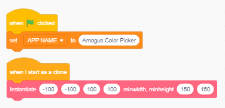
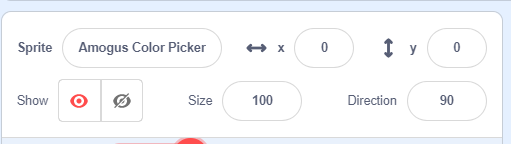

|
| **Step 2: Color in the App Window**

To do this, we draw a rectangle from the bottom left of the screen to the top right. 
Make the rectangle have a rounding of 5 to make it look nicer, instead of being sharp. 
An hsva value of :class:`"0, 0, 100, 100"` gives us a nice white background.

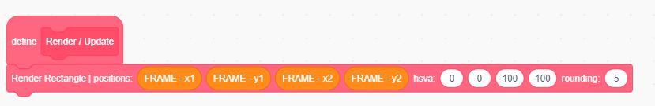

|
| **Step 3: Render our Amogus Character**

Drag the Amogus costume from the :class:`Assets` sprite to the :class:`Desktop Environment` sprite.

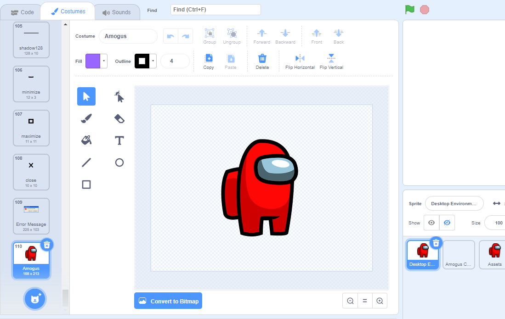

To render the asset, we call the :class:`Render Asset` function. 
Since we want to center the amogus character, we take the average of the 
left and right of the window, as well as the top and bottom. We render the sprite 
with a direction of 90 to make the character upright, and a size of 30 
since the character is quite big ;)

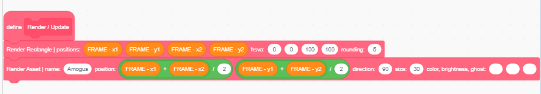

|
| **Step 4: Change the color of the Amogus Character**

Now let's make the character change color! Make a variable called :class:`Amogus Color`
FOR THIS SPRITE ONLY, and initialize it to 0 under the Load Data block. 

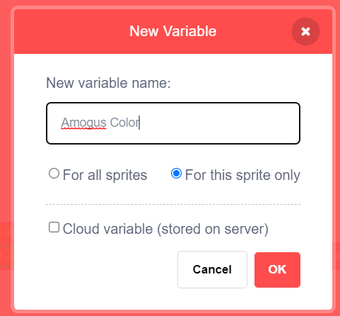

Then, drag the variable onto the :class:`color` parameter of the render asset custom block.

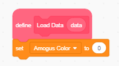
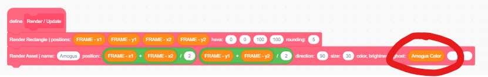

|
| **Step 5: Change color when Space Key Pressed**

We want to make the amogus character change color every time the space key is pressed. 
However, holding down the space key shouldn't continuously change the color. 
The color should only change the instant the space key is pressed.

Therefore, we keep track of whether the space key was pressed in the previous frame 
with the variable :class:`Was Space Key Pressed?`, and update the color variable if the space 
key is currently pressed, but wasn't on the previous frame.

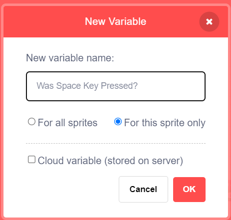

We put all this code under :class:`Inputs` as pressing space is a non-mouse input. Remember to 
initialize the variable as 0 in the load data block.

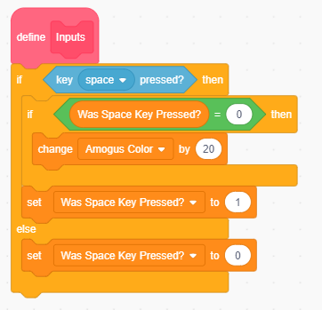
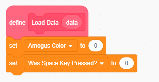

|
| **Step 6: Make Buttons to Change Color**

Now let's make some buttons that can also change the color of the character. 
Just like the Amogus costume, drag the AmogusArrow costume from the :class:`Assets` sprite to the :class:`Desktop Environment` sprite.

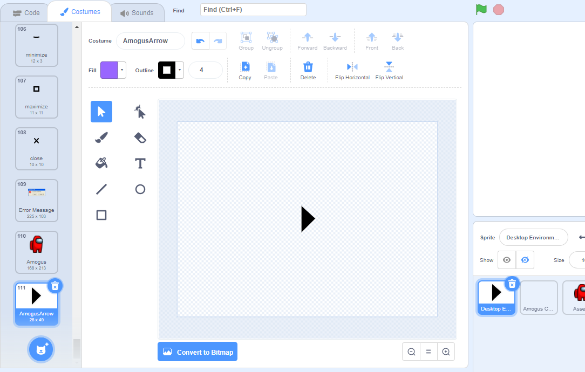

We can then render the arrow under the :class:`Render / Update` hat block, setting the x 
to :class:`x1 + 30` (30 pixels from the left of the frame), the y to the center 
(average of y1 and y2), size to :class:`100`, and direction to :class:`-90` (to rotate it the correct way). 
We can do this similarly to the right arrow, changing :class:`x1 + 30` to :class:`x2 - 30` and direction to :class:`90`.

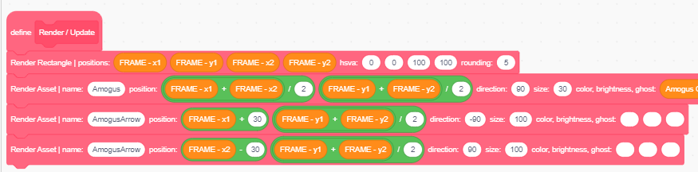

|
| **Step 7: Button functions when Clicked**

To do this, we need to check if the mouse pointer is touching the arrow. 
We can upload the arrow costume to the sprite and use the :class:`touching mouse pointer` block, 
but to simplify, we'll just add a rectangle hitbox around the arrow.

Then, we have to code up a custom block called :class:`Mouse Rectangle Collision` that detects whether or not your 
mouse is hovered over a rectangle. We do this by checking if :class:`x1 <= mouse x <= x2` 
and :class:`y1 <= mouse y <= y2` where :class:`<=` is the less than or equal sign.

.. note::
    Scratch does not have a :class:`less than or equal to` operator, so instead we use
    :class:`not greater than` to accomplish this.

Since scratch functions cannot return a value, we'll have to create a variable 
:class:`Mouse Hovered?` and have the function update its value. Make sure to 
initialize it to 0 in the :class:`Load Data` function.

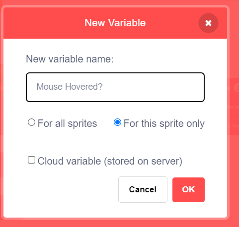
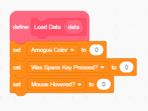

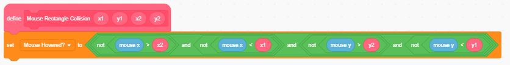

|
| **Step 8: Fit the Hitbox Bounds to our Arrow**

Note that the arrow is around :class:`20 pixels` wide and :class:`40 pixels` tall. 
Therefore, we want to subtract :class:`10` from the :class:`x` and :class:`25` from the :class:`y` to get :class:`(x1, y1)` 
and add :class:`10` to the :class:`x` and :class:`25` to the :class:`y` to get :class:`(x2, y2)`. An illustration is shown below 
to show why this is the case.

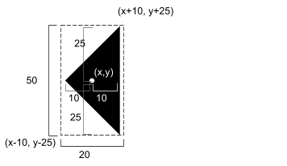
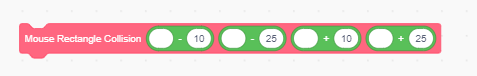

|
| **Step 9: Placing the Hitboxes**

Drag in the x & y positions of the arrows, and you have your two hitboxes. 
Put the code that detects the hitboxes right before rendering the arrows

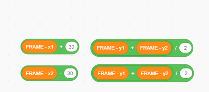
    
    x & y positions of the arrows

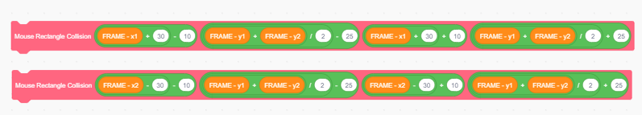

    plugging the positions into the function

Then, with a little hack, we can change the arrows brightness whenever the mouse is hovered.

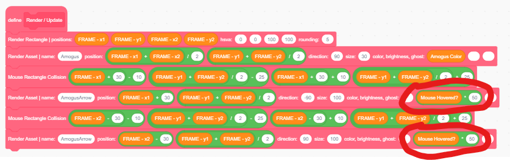
    
    putting the functions into use with the little hack

|
| **Step 10: Detect Mouse Down**

Now, we need to detect if the mouse is down while hovering over the buttons. 
We can do this similarly to the space key detection we coded earlier. 

Create a variable called :class:`Was Mouse Down?` to keep track if mouse was 
down the previous frame, and make sure to initialize it in :class:`Load Data`

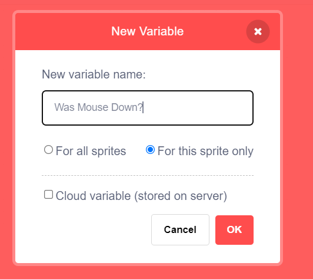
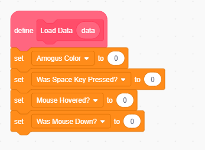

Now, update the :class:`Amogus Color` variable on the condition that the mouse is 
hovered over a button, and the frame before wasn't clicked. Note that we have to 
do this before a second call to the Mouse/Rectangle collision function, 
as the second call would override the :class:`Mouse Hovered` variable, and we don't want that. 
Remember to update the :class:`Mouse Down` variable at the end.

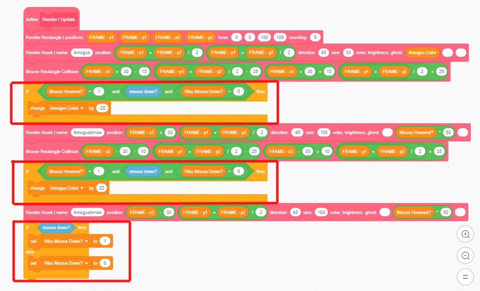

|
| **🎉 Congratulations! 🎉**

You have just made an Amogus Color Picker on the Blue OS 7 Windows Manager! 
Try creating your own app now and see how it works!

Coding Practices
----------------
.. topic:: Guidelines to Follow

    1. Always create variables with "in this sprite only" (unless you need to store a variable that is shared between clones and you know what you are doing)
    2. Try to make costume names unique, so that there are no overlapping costume names
    3. Split processes into custom blocks for organization and better reading