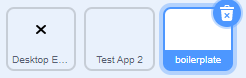
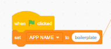
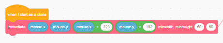
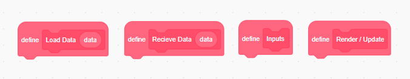
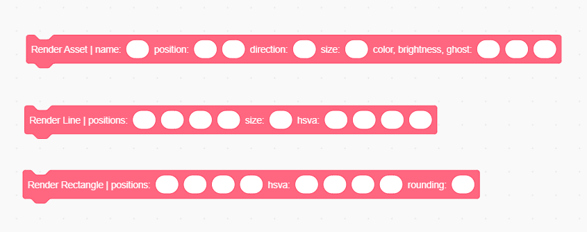

Windows Manager
===============

Introduction
------------
.. topic:: Overview

    The :class:`Windows Manager` is the main interface between your code and
    the windowing system. We will be learning where and how to call rendering functions, 
    to make an app for Blue OS 7.

    | You can explore and follow along using the code here: https://scratch.mit.edu/projects/674261354/ 

.. topic:: Conventions

    1. (x1, y1) are the bottom left corners of the rectangle (the lesser values), (x2, y2) are the top right.
    2. All pen coloring uses hsva: "Hue, Saturation, Value, Alpha". Google for more info.
    3. Put all assets in a separate sprite so that we can upload it to the main Window Manager (Alternatively, attach a .zip file of all assets from the app on the app Scratch page so we can add it to the main file).

Setup
-----
| Step 1: Go to the boilerplate sprite

| Step 2: Change sprite name

| Step 3: Change this to set app name to sprite name

| Step 4: Change this to edit where the window starts when opened. First 4 parameters are x1, y1, x2, & y2, last two are the minimum width and height of the window

Basics
------
| **Four main functions:** 

.. important:: 
    All APP CODE should go under these four functions! 

Load Data
  Treat this function as a :class:`When green flag clicked` hat block. Sometimes, data may be sent to the app at creation (for example, a picture was opened, and the app was sent the data of the picture)

Receive Data
  This is for inter app communication, honestly don't worry about this hat block until the File Explorer comes out.

Inputs
  Treat this block as a block called inside of a forever loop. However, this block only calls when the app is focused. Update any variables according to any sensing block (besides mouse sensing).

Render/Update
  Treat this block as a block called inside of a forever loop. This block will be called whether or not the window is focused. All code that doesn't go into :class:`Inputs` should go here. Code including sensing blocks (besides mouse sensing blocks) should *NOT* go here.

Rendering functions
-------------------

Assets are costumes that you would render while an app is running. 
All assets are stored in the Desktop Environment sprite. Call these functions to render any asset. 
(they should be pretty straightforward, so I won't explain everything)

Render Asset
  | First, import an asset to the :class:`Desktop Environment` sprite

  .. image:: images/windows_manager/render_asset.png

  The name of the asset would be the costume name you give it.

Line Positions
  x1, y1, x2, y2, draws a line from :class:`(x1, y1)` to :class:`(x2, y2)`

Rectangle Positions
  x1, y1, x2, y2, :class:`(x1, y1)` is bottom left, :class:`(x2, y2)` is top right

Rectangle Rounding
  radius of the circle at the corners of the rectangle (0 for sharp corners)

.. tip:: 

  | **Useful Variables**

  .. image:: images/windows_manager/useful_variables.png

  | :class:`FRAME-IsFullScreen?` - 1 if app is in full screen, 0 if app is not
  | :class:`FRAME-x1`, :class:`FRAME-y1`, :class:`FRAME-x2`, :class:`FRAME-y2` -  (x1, y1) is bottom left of the window, (x2, y2) is the top right of the frame